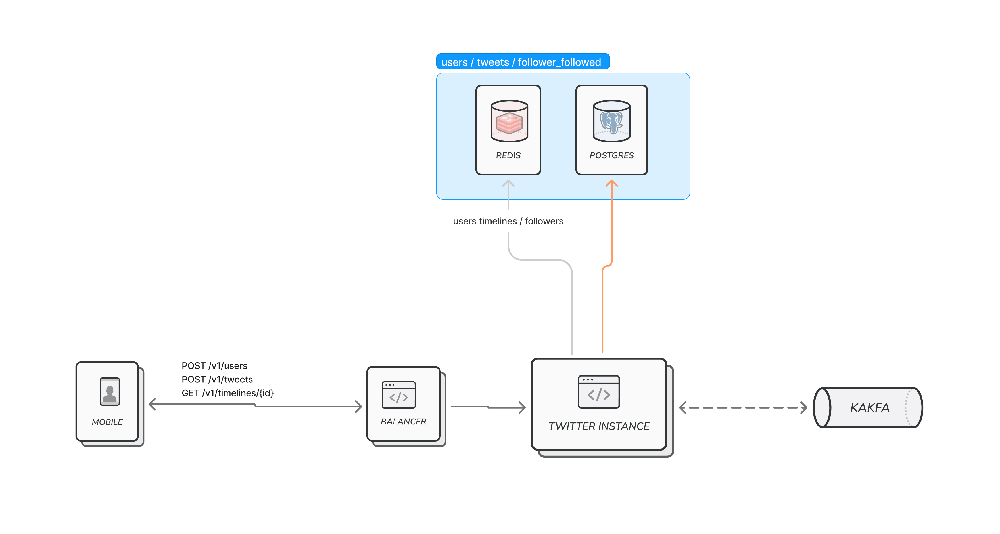

# twitter
[](https://localhost:8080/swagger-ui/index.html)

## Description:
POC to undertanding twitter architecture 

## Architecture


## Index:
- [Stack](#stack️)
- [How to Run](#how-to-run)
    - [Prerequisites](#prerequisites)
    - [Build](#build)
    - [Run](#run)
    - [Unit Tests](#unit-tests)
- [Create Docker Images](#create-docker-images)
    - [Build Docker Images](#build-docker-images)
    - [Tag your Docker image](#tag-your-docker-image)
    - [Login to Your Docker Hub](#login-to-your-docker-hub)
    - [Push the Docker image](#push-the-docker-image)

### Stack 🛠️
- kotlin 1.9.21
- spring-boot 3.2.1
- [mySql](https://www.mysql.com/)
- [apache-kafka](https://kafka.apache.org/)
- [liquibase](https://www.liquibase.org/)
- [docker](https://www.docker.com/)
    - [docker-compose](https://docs.docker.com/compose/)

### How to Run
#### Prerequisites

Ejecutar el [docker-compose](docker-compose.yml).
Esto levanta un mySql, un redis y un kafka local.

#### Build
Ejecuta éste comando para instalar las dependencias y buildear el proyecto:

  ```bash
  $ ./gradlew build
  ```


#### Run

Para correr el proyecto:

```bash
$ ./gradlew bootRun
```

El entorno de desarrollo corre sobre <http://localhost:8080>. Ejecuta una llamada GET de prueba en <http://localhost:8080/actuator>

#### Unit Tests

Para correr los tests unitarios
```bash
$ ./gradlew test
```

### Create Docker Images

#### Build Docker Images
Dentro del directorio raiz del
proyecto ejecutar el siguiente script (cambiar la version de acuerdo a la actual del proyecto)

```bash
$ sudo docker build --build-arg appName=arithmetic-api --build-arg version=1.0.0 --tag arithmetic-api .
```

#### Tag your Docker image
Antes de enviar la imagen a Docker Hub, etiquetarla con el nombre de repositorio adecuado. Reemplace
your-dockerhub-username con su nombre de usuario de Docker Hub.

```bash
$ docker tag arithmetic-api:latest your-dockerhub-username/arithmetic-api:latest
```

#### Login to Your Docker Hub

```bash
$ docker login
```

#### Push the Docker image

```bash
$ docker push your-dockerhub-username/arithmetic-api:latest
```
